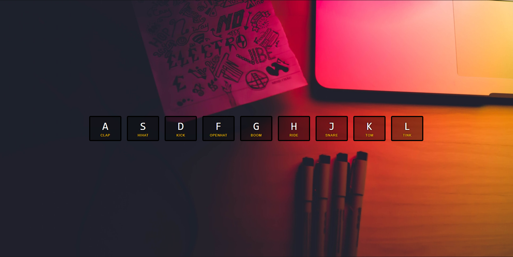

### Useful websites:
- Look for key code: http://keycode.info/
- Emmet Documentation: https://docs.emmet.io/cheat-sheet/

### What I have learned?
1. Key events
2. Add/remove CSS class for animations
3. Play audio
4. Listening to transition/animation end events


- `data-key` is not a stand attribute, this is a made up attribute. Use `data-<something>` to create an attribute. (Could have used id attribute for the same purpose.)
- ES6 template string: "`${}`".
- Attribute selector && template string `${}` for keyCode values.
```
const audio = document.querySelector(`audio[data-key="${event.keyCode}"]`);
```
- Query selector could get `a class, a tag`:
```
// Tags
document.querySelector(`audio[]`);
document.querySelector(`div[]`);
// Classes
const key = document.querySelector(`.key[]`);
```
- Add CSS class: `key.classList.add('playing');`
```
Other types: classList.add/remove/toggle
1. key.classList.add('playing');
2. key.classList.remove('playing');
3. key.classList.toggle('playing');
```
