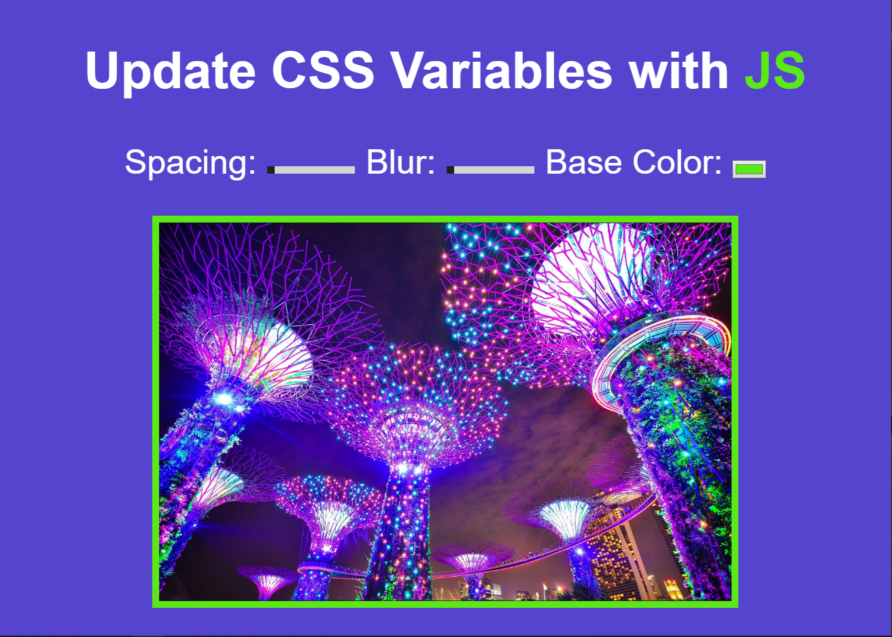
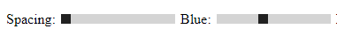
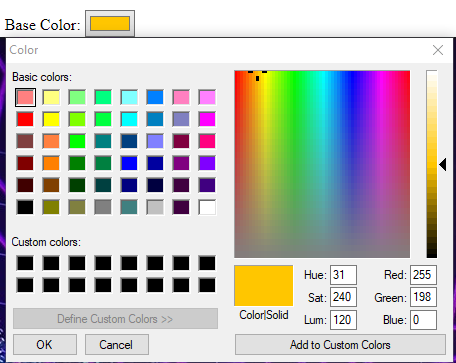

### Useful websites:
- https://developer.mozilla.org/en-US/docs/Web/CSS/Using_CSS_custom_properties
- https://medium.freecodecamp.org/everything-you-need-to-know-about-css-variables-c74d922ea855

### What I have learned?
#### 1. Different types of input.
- Input type:range:



- Input type:color:



#### 2. CSS Variables.
- Declare variables:
```
:root {
    --base: #ffc600;
    --spacing: 10px;
    --blur: 10px;
}
```
- Call and use them:
```
img {
    padding: var(--spacing);
    background: var(--base);
    filter: blur(var(--blur));
}
```
- NOTES: `filter` is for blurry values.

- NodeList vs Array:
```
1. Array has map, reduce and ... a lot more good stuff.
2. NodeList has entries, forEach, item, keys, values.
```

- Made up data attributes `data-<attribute name>`.
```
<label for="blur">Blur:</label>
<input  type="range" 
        name="blur" 
        min="0" 
        max="25" 
        value="10"
        data-sizing="px">
```

- `this.dataset` is an object that contains all the data of the `data-...` attributes.
```
// data-sizing="px"
const suffix = this.dataset.sizing || ''; // Output: px
```

- By matching the `name` in the `<input>` tag, set the attribute values by select the name.
```
const suffix = this.dataset.sizing || '';
document.documentElement.style.setProperty(`--${this.name}`, this.value + suffix);
```

#### 3. Source Code.

- JavaScript:

```
const inputs = document.querySelectorAll('.controls input');
function handleUpdate() {
    // data-sizing="px"
    const suffix = this.dataset.sizing || '';
    document.documentElement.style.setProperty(`--${this.name}`, this.value + suffix);            
}

inputs.forEach(input => {
    input.addEventListener('change', handleUpdate);
    input.addEventListener('mousemove', handleUpdate);
});
```

- CSS:

```
:root {
    --base: #5be817;
    --spacing: 10px;
    --blur: 10px;
}

img {
    padding: var(--spacing);
    background: var(--base);
    filter: blur(var(--blur));
}

.hl {
    color: var(--base);
}

body {
    text-align: center;
    background: #5444ce;
    color: white;
    font-family: Arial, Helvetica, sans-serif;
    font-weight: 100;
    font-size: 50px;
}

.controls {
    margin-bottom: 50px;
}

.img-container {
    width: 65%;
    height: 100%;
}

```

All done! Yaaaaay!
