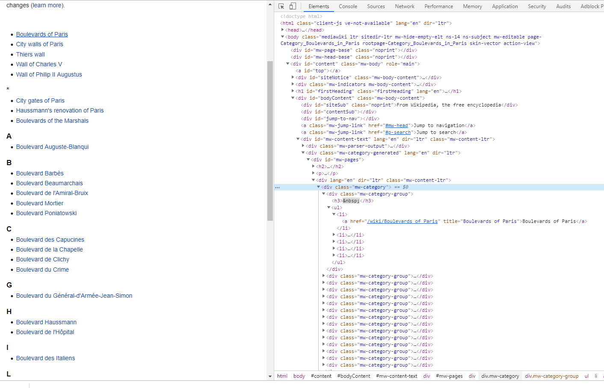

### Useful websites:
- Filter: https://developer.mozilla.org/en-US/docs/Web/JavaScript/Reference/Global_Objects/Array/filter
- https://en.wikipedia.org/wiki/Category:Boulevards_in_Paris

### What I have learned?
#### 1. Filter: 
- Take in a function, return a boolean.
```
var words = ['spray', 'limit', 'elite', 'exuberant', 'destruction', 'present'];

const result = words.filter(word => word.length > 6);

console.log(result);
// expected output: Array ["exuberant", "destruction", "present"]
```
- `Array.prototype.filter()`
- Filter the list of inventors for those who were born in the 1500's
```
const fifteen = inventors.filter(inventor => inventor.year >= 1500 && inventor.year < 1600);
```


#### 2. Map: 
- `Array.prototype.map()`
- Give us an array of the inventor first and last names
```
const fullNames = inventors.map(inventor => `${inventor.first} ${inventor.last}`);
console.log(fullNames);
```


Array.prototype.sort()
3. Sort the inventors by birthdate, oldest to youngest
```
const ordered = inventors.sort((a, b) => a.year > b.year ? 1 : -1 );
console.table(ordered);
```


Array.prototype.reduce()
4. How many years did all the inventors live?
```
const totalYears = inventors.reduce((total, inventor) => {
    return total + (inventor.passed - inventor.year);
}, 0);
console.log('==>> totalYears', totalYears);
```


5. Sort the inventors by years lived
```

const oldest = inventors.sort((a, b) => {
    const lastGuy = a.passed - a.year;
    const nextGuy = b.passed - b.year;
    return lastGuy > nextGuy ? -1 : 1;
});
console.table(oldest);
```


6. create a list of Boulevards in Paris that contain 'de' anywhere in the name
https://en.wikipedia.org/wiki/Category:Boulevards_in_Paris

```
const category = document.querySelector('.mw-category');
// Will return a NodeList => need to convert to an Aarray
// const links = category.querySelectorAll('a');
// const links = Array.from(category.querySelectorAll('a'));
// ES6 spread 
const links = [...category.querySelectorAll('a')];
const de = links
            .map(link => link.textContent)
            .filter(streetName => streetName.includes('de'));
```



7. sort Exercise
Sort the people alphabetically by last name
```
const alpha = people.sort((lastOne, nextOne) => {
    const [aLast, aFirst] = lastOne.split(', ');
    const [bLast, bFirst] = nextOne.split(', ');
    return aLast > bLast ? 1 : -1;
});
console.log(alpha);
```


8. Reduce Exercise
Sum up the instances of each of these
```
const data = ['car', 'car', 'truck', 'truck', 'bike', 'walk', 'car', 
'van', 'bike', 'walk', 'car', 'van', 'car', 'truck', 'pogostick'];
const transportation = data.reduce((obj, item) => {
    if(!obj[item]) obj[item] = 0;
    obj[item]++;
    return obj;
}, {});
console.log(transportation);
```


All done! Yaaaaay!
